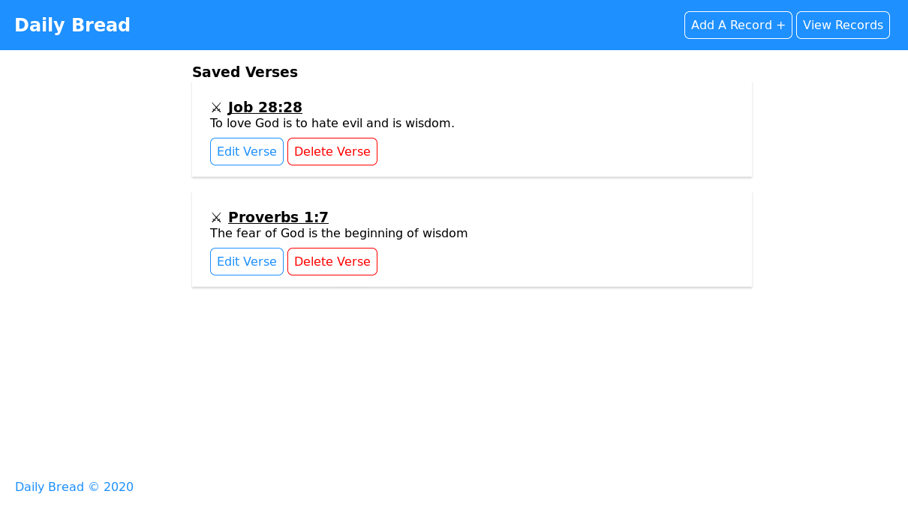
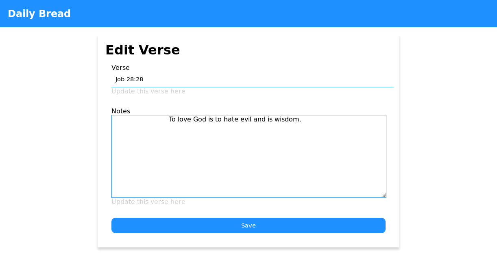

# Daily_Bread

A Bible verse and note taking web app to help read and note down Bible verses.

## Features

- Users can add a Bible verse and take short notes on it.
- Such records should be persisted for daily use if needed and sorted by date.

## Requirements

- Python 3.x
- Flask
- Flask-Migrate
- Flask-SQLAlchemy

## 

## 

## 

## Author

Ssali Jonathan
